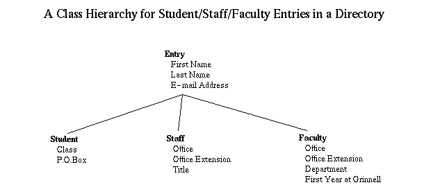
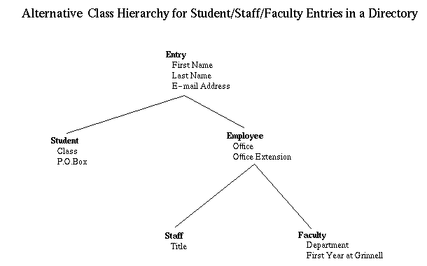

# Example: directory project
This is an extended example (a directory of students, faculty, and staff), introducing how related classes may be defined and used within a hierarchy of class definitions in C++.

The resulting code illustrates a powerful problem-solving mechanism, utilizing inheritance, polymorphism, operator`<<` overloading, and virtual functions in C++.

## Project Organization

Four types of _directory_ entries are possible, each with its own class

 - `Entry`, the base class for a _directory_ entry
 - `Student`, a derived class of `Entry` for a student
 - `Faculty`, a derived class of `Entry` for a faculty member
 - `Staff`, a derived class of `Entry` for a staff member
 - `SchoolDirectory`, a collection of `Entry` objects

The project structure is organized as:

```
ex-directory
├── Entry.cpp
├── Entry.h
├── Faculty.cpp
├── Faculty.h 
├── Makefile
├── SchoolDirectory.cpp
├── Staff.cpp
├── Staff.h
├── Student.cpp
├── Student.h
```

 - [`Entry.h`](Entry.h), [`Entry.cpp`](Entry.cpp): header and implementation of `Entry` class
 - [`Student.h`](Student.h), [`Student.cpp`](Student.cpp): header and implementation of `Student` class
 - [`Faculty.h`](Faculty.h), [`Faculty.cpp`](Faculty.cpp): header and implementation of `Faculty` class
 - [`Staff.h`](Staff.h), [`Staff.cpp`](Staff.cpp): header and implementation of `Staff` class
 - [`SchoolDirectory.cpp`](SchoolDirectory.cpp): implementation of `SchoolDirectory` class
 - [`Makefile`](Makefile): makefile for building the project

## Building

    make
    ./SchoolDirectory

## A Student, Staff, and Faculty Directory

Consider the problem of maintaining a _directory_ of students, staff, and faculty. For the purposes of this lab, suppose an entry in the _directory_ has the following fields:

- All entries have:
    - First name
    - Last name
    - e-mail address
- Student entries have:
    - Class
    - P.O.Box
- Staff entries have:
    - Office
    - Office Extension
    - Title
- Faculty entries have:
    - Office
    - Office Extension
    - Department
    - First year of employment

A _directory_ shoud support these operations (methods):

- Add entry
- Print all entries (alphabetically by name)
- Update entry
- Remove an entry
- Retrieve entry, given the name

### Some Observations
This problem illustrates some common characteristics of a variety of applications. At one level, we want to consider all people in the directory as being similar -- the directory should be a collection of entries. At another level, each type of person (e.g., students, staff, faculty) has special characteristics.

One way to accommodate such multiple levels is develop an appropriate class hierarchy. In this case, we might begin with an Entry class and then define three subclasses, Student, Staff and Faculty. Schematically, this is shown in the following diagram:



Noting that both Staff and Faculty have offices and office extensions, this hierarchy might be refined further, as follows:



For an extended example, this alternative hierarchy might have several advantages as more common characteristics of staff and faculty were identified. For simplicity in what follows, however, we adopt the first of these class hierarchies, focusing on classes `Entry`, `Student`, and `Faculty` for individuals and class `SchoolDirectory` for the overall structure. The development of the `Staff` class is left as an exercise.

### The Entry Class
The `Entry` class should contain the data and capabilities that we might want for the records of all types of people. In reviewing the problem, some obvious methods involve the creation of an entry, converting the class to a string (for printing), and checking if an entry's name matches a given name. In addition, if names are to be stored alphabetically, it will be convenient to be able to compare if one entry equals another or if one entry comes before another alphabetically. Program [Entry.cpp](Entry.cpp) contains a simple version of such an Entry class.

#### Design Principle
An _object_ or a _class_ is a __self-contained entity, and it should include those data elements and operations that naturally support that entity__. For the `Entry` class, we identify both data and operations which seem closely related to each other and to our image of what directory entries might contain.

As you review this `Entry` class, note that it contains its own testing code in its `main` method. When this code is run by itself, this `main` method will run to provide appropriate testing. When `Entry` is imported and another class is run, then that class's `main` will provide the basis for program execution.

### The Student Subclass
With `Entry` defined, we can define the Student class by extending `Entry` and adding only the few new required fields. The resulting code is [Student.cpp](Student.cpp)

For the most part, the code in `Student.cpp` is straightforward. However, in one place, we want to utilize existing code in super class `Entry` as a first step in later processing. Specifically, when initializing a `Student`, we need to first re-use the super class `Entry`'s constructor to initialize the inherited fields, `firstName`, `lastName`, and `eAddress`.

    Student::Student (std::string first, ...) 
      :  Entry(first, last, addr)

The colon symbol `:` begins a _member intializer list_ and its role here it to run the `Entry` super class constructor just before the `Student` constructor is run.

### The Faculty Subclass
Program [Faculty.cpp](Faculty.cpp) provides an implementation of the `Faculty` class. As with `Student`, we take advantage of the `Entry` super class when we can, although some new or adjusted methods are needed.

### The School Directory Class
Before writing the `SchoolDirectory` class, we must decide how to store entries. As suggested earlier, one approach is to keep the entries, arranged alphabetically by name, in an array -- but what size should the array be? One approach is to create an array of some size `maxSize` and maintain a separate variable `currentSize`. We can keep adding entries to the array until `currentSize` equals `maxSize`. At this stage, we could generate a larger array (perhaps twice the size), copy the old array to the new, larger one, and then make the insertion. Such an approach does not place an arbitrary limit on the directory size, but also does not waste space excessively.

With this approach to array expansion, we can insert new elements in name order, following the insertion process from an insertion sort. Printing can follow a linear scan of the array, and data retrieval can follow from a binary search. For data retrieval, however, we still must decide what the search should return. A common approach would yield the entry in question, so the program could do subsequent processing if desired. All of this work follows algorithms and approaches seen previously in the course, and we can present a first version of program [SchoolDirectory.cpp](SchoolDirectory.cpp).

## Inheritance, _is-a_ Relationships, and Polymorphism
While the coding within `SchoolDirectory.cpp` follows directly, the resulting program illustrates several important points:

- Method `add` depends upon both `Student` and `Faculty` being subclasses of `Entry`. In particular, the parameter `person` for `add` must be an `Entry`. Through inheritance, every `Student` and `Faculty` object is just a special case of an `Entry` object, so this requirement holds. Inheritance sometimes is said to reflect an __is-a__ relationship -- every `Student` _is-a_ `Entry`, so we can use a `Student` object anywhere the code requires an `Entry` object.

 Further, `add` only relies on methods guaranteed to exist for an `Entry`, so the logic works correctly for `add` -- regardless of whether the `person` is just an `Entry` or a special `Entry` (e.g., a `Student` or `Faculty`).

- Inheritance identifies methods that are available for the class and any subclass, so objects of different subclasses may be used in a broad framework.
 In object-oriented problem solving, the interpretation of the method by an object as the code is running is called __polymorphism__. With polymorphism, the program can identify the name of a method when the program is written and compiled. However, the details of the method are not decided until the program is actually run, as the specific class for the method may change from one run to the next. Polymorphism provides the mechanism for the details of this method to be interpreted when needed during execution. For this application, we have defined our own `toString` method for each `Entry` class and subclass, so the printing of each entry will look appropriate.

- `SchoolDirectory`'s method `print` takes advantage of polymorphism and may be deceptively simple. By writing 

    ```
    for (int i = 0; i < entryVec.size(); i++) {
       std::cout << entryVec[i] << std::endl;
    }
    ``` 

 we employ the `<<` operator to each `Entry` object. The logic just cycles through a sequence of entries and prints them. However, details for printing a `Student` are not the same as those for a `Faculty`. The `<<` operator uses the (virtual) `print` method for each `entryArray[i]` object. Based on the type of each `entryArray[i]` object, which `print` method is called depends on what subclass it is. A `Student` uses their `print` method, while `Faculty` uses their own.


## Unit Testing
The implementation file of each entry class/subclass contains a main procedure for unit testing.  However, since a compiled program can only contain one active main procedure, and the entire `SchoolDirectory` application has its own main procedure, the main procedures are commented out in Entry.cpp, Student.cpp, Faculty.cpp, and Staff.cpp.

To run unit testing for the Entry Class:

1.  Edit Entry.cpp, so the main procedure is no longer commented out
2.  In a terminal window, compile with the command

        g++ -o Entry Entry.cpp

3.  Run the tests with the command
    ./Entry
4.  When unit testing of Entry is complete, restore the commenting for
    the main procedure

To run unit testing for subclasses Student, Faculty, or Staff

1.  Uncomment the main procedure in the desired subclass (e.g., Student.cpp)
2.  In a terminal window, compile Entry.cpp to yield an object file Entry.o
    with the command

        g++ -c Entry.cpp

3.  Compile the desired subclass (e.g., student.cpp) with the command

        g++ -o Student Student.cpp Entry.o

3.  Run the tests with the command

        ./Student

4.  When unit testing of Student is complete, restore the commenting for main


## Revision History

 - created 2 May 2000 by Henry M. Walker, [Original](http://walker.cs.grinnell.edu/courses/207.sp12/readings/reading-generalization.shtml)
 - revised 27 January 2012
 - revised to eliminate references to PrintWriter, update entry 4 February 2012
 - translated to C++ 9 January 2023, [Revised](https://blue.cs.sonoma.edu/~hwalker/cpp-style-guide/directory/index.php)
 - significant revision into Markdown for GitHub, June 2023
